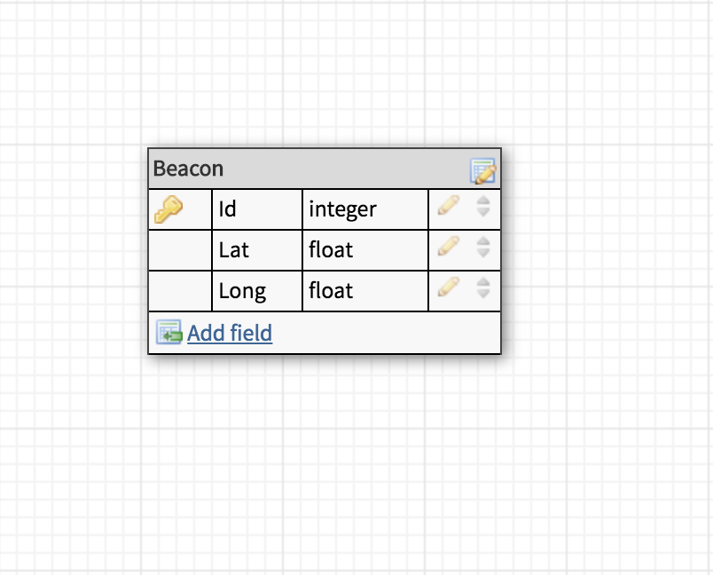

### To trigger alarm:
https://machine-mock.herokuapp.com/api/v1/devices/1

---

# Mock Hardware Application

The purpose of this application is to simulate the hardware which will eventually send GPS coordinates to the Machine Ltd backend tracking API. This application is setup to do two things: send a POST request to the Machine `api/v1/devices/:device_id/locations` endpoint. It will do whis with a single Beacon object, mimicking the interaction pattern of a device that hasn't moved. The repo also provides a link that will trigger an sms alert.

---
### Versions
- Ruby 2.4.1
- Rails 5.2.0

##### Dependencies
- Puma 3.11
- Faraday
- Whenever
- RSpec


---

### Database
The database has one table:

Beacons - This is to represent the format of the hardware device sending data to the Machine Ltd backend API.

A beacon only has two attributes - latitude and longitude.



##### Database initialization
To initialize a database in rails run the following commands:

```
rake db:create
rake db:migrate
```
---

### Test Suite

The test suite is written with RSpec and allowed for correct POST request formatting to the Machine API.

To run the test suite:
```
rspec
```
